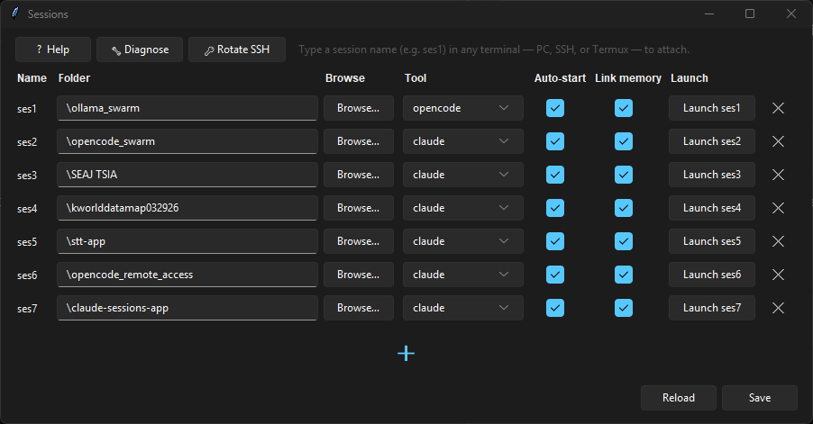

# AI Sessions

> **How I use it:** I run coding assistants (Claude Code, OpenCode, Grok Build, and more) on my laptop PC and reach them from my phone over [Tailscale](https://tailscale.com/). Paired with my [Speech-to-Text app](https://github.com/kevinkicho/speech-to-text-app), I can dictate prompts from the phone while away from the keyboard — no typing on a glass keyboard required.



Manage multiple coding assistant conversations across your PC and Android devices. Each "session" is a named WSL tmux session pinned to a project folder. Supports [Claude Code](https://claude.com/claude-code), [OpenCode](https://opencode.ai), [Grok Build](https://x.ai/cli), and easily extensible to more. Type `ses1`, `ses2`, etc. in any terminal and attach. Works identically over SSH from a phone — including live mirrored view.

**Formerly known as Claude Sessions** — now rebranded to AI Sessions to reflect support for multiple AI coding assistants.

## Why I built this

I had several projects running in parallel on a Windows PC, and I often wanted to check on or continue one from my phone or tablet while away from my desk. Plain remote desktop (VNC) over Tailscale worked but typing on Android's keyboard through a remote-desktop view was miserable. SSH from Termux gave me a real keyboard, but spinning up `tmux attach -t somename` with different names for each project got tedious, and Claude Code's per-project memory on Windows and WSL lived under different slugs so I'd lose context when crossing the OS boundary.

This tool fixes all of these:

- Short, memorable commands (`ses1`, `ses2`, ...) that attach from anywhere.
- Each session is tied to a project folder, configured once in a GUI.
- **Multi-tool support:** pick Claude Code, OpenCode, Grok Build, or others per session via a dropdown.
- Optional symlink so tool memory is shared between Windows-side and WSL-side instances for a given folder.
- Multiple devices (laptop, phone, tablet) can attach to the same session simultaneously. Type on one; see it on the others in real time.

## Real-life use cases

- You start a refactor on the PC in the morning, then continue the same conversation from your phone on the train without losing context.
- You are cooking and remember a bug — you open Termux, type `ses2`, dictate the fix using the [Speech-to-Text app](https://github.com/kevinkicho/speech-to-text-app), and the assistant edits the code on the PC.
- You watch a long run from the couch on your tablet while the actual work happens on the PC in another room.
- You hand the tablet to a colleague so they can read along while you drive from the laptop — both screens stay in sync live.
- You leave the house with a task running and check in from your phone every so often to see progress and answer prompts.
- You want to swap a project mid-thought between Windows-side and WSL-side tools without losing conversation history (the symlink option handles this).
- You suspect a phone's SSH key has been exposed, so you click 🔑 Rotate SSH on the PC and have a fresh key on every device in a couple of minutes.
- You are in bed and want to ask one quick question about a project — `ses1` from the phone is faster than walking to the desk.

## How it works

```
Windows PowerShell        SSH from phone Termux        SSH from tablet Termux
        |                          |                             |
        +------------- tmux attach --------+------- tmux attach -+
                                           |
                                  shared named session
                                 "ses1" (or ses2, ...)
                                           |
                                   WSL Ubuntu bash
                                 opened in folder X
                                           |
                          klaud / ocd / grok (Claude Code / OpenCode / Grok Build)
```

Under the hood:

1. A GUI (`sessions_gui.pyw`) edits `sessions.json`, which maps each name (ses1, ses2, ...) to a folder, tool (Claude Code / OpenCode / Grok Build / ...), and boolean toggles.
2. On save, the GUI generates `ses1.cmd`, `ses2.cmd`, ... in a directory on your Windows PATH.
3. Each `sesN.cmd` calls `session_launch.py`, which runs `wsl -d Ubuntu -- tmux new-session -A -s sesN -c <folder>`. `-A` attaches if the session already exists, creates otherwise.
4. A tool registry (`tools_config.py`) defines each assistant's CLI, shell helper function (`klaud` for Claude, `ocd` for OpenCode, `grok` for Grok Build), and memory paths. Adding support for a new tool is a single entry in this file. The launcher and GUI use it for everything.
5. If "Auto-start" is on, the session's first run executes the tool's helper function (e.g. `klaud` resumes an existing Claude conversation, or starts fresh; `grok` launches Grok Build).
6. If "Link memory" is on, a symlink is created inside WSL so Windows and WSL instances share the same per-project conversation history (only for tools that use per-project memory directories on disk, e.g. Claude Code).

## Features

- Dark-mode GUI (Sun Valley theme) with tooltips and a built-in Help dialog
- **Multi-tool support** — per-session dropdown for Claude Code, OpenCode, Grok Build, and more (extensible)
- Dynamic session list: starts with 3 rows, `+` button adds more with no hard limit
- Per-row `x` button removes a session (doesn't touch tool memory or running tmux state)
- Per-row Launch button opens that session in a new console window
- All options persist to `sessions.json`
- Memory symlink sharing between Windows and WSL tool instances (tool-specific paths; skipped for OpenCode and Grok Build)
- **SSH key rotation panel** — rotation of the SSH key used by your Android devices, with ADB push from the PC and a one-word command on each device
- **Self-Diagnose panel** — one-click check of every prerequisite (WSL, Ubuntu, tmux, tools, PATH, sessions, OpenSSH, authorized_keys, Tailscale, ADB) with a fix hint for anything missing

## SSH key rotation panel

Click **🔑 Rotate SSH** in the toolbar to open a dialog that drives the whole key-rotation flow. Two PC-side buttons + one device-side step:

- **Step 1 — Push rotate-key script to connected device(s)** — ADB-pushes `rotate-key.sh` to `/sdcard/rk.sh` and the current private key to `/sdcard/Download/id_ed25519` on every connected device. Idempotent — safe to re-run. One-time per device.
- **Step 2a — 🔑 Generate new SSH key (UAC swap)** — generates a new ed25519 keypair locally, triggers one UAC prompt to replace `C:\ProgramData\ssh\administrators_authorized_keys`, and issues a 10-minute rotation token. Does **not** push to any device — that's 2b. Click ONCE per rotation.
- **Step 2b — 📤 Push current key to connected device(s)** — pushes the currently-staged private key to whatever devices are connected right now. Split out from 2a because most setups only have one free USB port. Safe to click many times.
- **Step 3 — on each device** — close Termux (swipe out of Recents), reopen it, and type `rotate-key`. This can't be automated from the PC because Android blocks ADB from holding Termux's `RUN_COMMAND` permission; see [Why no "Run rotate-key" button?](#why-no-run-rotate-key-button) below.

The dialog also shows:

- Live list of ADB-connected devices (with a **Rescan** button).
- A **Remote token** field with copy-to-clipboard and a live expiry countdown, for updating devices not plugged in (they fetch over Tailnet from the PC's `/keyfile` endpoint — see [speech-to-text-app](https://github.com/kevinkicho/speech-to-text-app)).
- A scrolling **Log** of every step.

### Device-side `rotate-key`

Each Android device needs the `rotate-key` Termux command installed once. One-time bootstrap, run inside Termux after clicking Step 1 on the PC:

```
termux-setup-storage
bash /sdcard/rk.sh install
```

(The GUI's Step 1 button pushes `rotate-key.sh` to `/sdcard/rk.sh`; `termux-setup-storage` lets Termux actually read that file.) After install, every future rotation is:

```
rotate-key
```

The script self-updates from `/sdcard/Download/rotate-key.sh` on every run, so PC-side script improvements propagate automatically without a re-install.

### Why no "Run rotate-key" button?

An earlier version of the panel had a third button that dispatched `rotate-key` via Termux's `RUN_COMMAND` intent, aiming for fully headless rotation. It was removed because it can't work reliably on stock Android: the `RUN_COMMAND` intent requires the caller to hold `com.termux.permission.RUN_COMMAND`, and the ADB shell user (`com.android.shell`) can't request or be granted that permission, so Android always rejects the dispatch. The button's "failed" messages were misleading (it kept claiming Step 1 wasn't done when it actually was). Typing `rotate-key` once in Termux is the honest path.

<details>
<summary>Advanced: the `run-as` trick (and why it's not the default)</summary>

There is one way to execute a command *inside* Termux's sandbox from ADB without the `RUN_COMMAND` intent: `adb shell "cat /sdcard/script.sh | run-as com.termux env HOME=/data/data/com.termux/files/home files/usr/bin/bash"`. This works — but only against a **debug-signed** Termux APK. Android only lets `run-as` enter packages that declare `android:debuggable="true"` in their manifest, which is limited to debug builds.

- The Termux APK from [GitHub releases](https://github.com/termux/termux-app/releases) named `termux-app_vX.Y.Z+github-debug_arm64-v8a.apk` is debug-signed → `run-as` works.
- The F-Droid build and the `*-release-*` variant from GitHub are release-signed → `run-as` is blocked.

The setup docs recommend the release-signed builds because they're the normal, secure choice. If you genuinely want fully headless remote administration of Termux from your PC (not just the rotation flow), sideload the debug build — but accept that you're running a debuggable app, and Termux installed this way can't be upgraded in place from F-Droid without uninstalling first.
</details>

### Files that ship with rotation

- `rotate-ssh.bat` — double-clickable CLI entry point.
- `rotate-ssh.ps1` — main PowerShell; `-TokenOnly` skips keygen+swap and just issues a fresh token for the current key.
- `swap-authorized-keys.ps1` — the elevated helper that replaces `administrators_authorized_keys` (invoked via `Start-Process -Verb RunAs`).
- `rotate-key.sh` — Termux client for the device side (install, self-update, local-file or token-fetch modes).

The private key, public key, token state, and rotation logs are kept outside the repo (in a local `tools/` directory that is gitignored and contains the actual secret material — never commit it).

## Prerequisites

**Windows PC (10 build 19041+ or 11):**
- WSL 2 with Ubuntu installed
- Python 3.10 or newer (for the GUI)
- `sv-ttk` Python package (`pip install sv-ttk`) — for the dark theme
- `tmux` installed inside Ubuntu
- At least one coding assistant installed in WSL:
  - **Claude Code:** `npm install -g @anthropic-ai/claude-code` + the `klaud` bash function (see Setup)
  - **OpenCode:** `npm install -g opencode-ai` + the `ocd` bash function (see Setup)
  - **Grok Build:** `curl -fsSL https://x.ai/cli/install.sh | bash` (the `grok` command in PATH is sufficient for basic auto-start; optional `grok()` wrapper for customization) (see Setup)
- OpenSSH Server (Windows optional feature) so the phone can SSH in
- A folder on your PATH for the `sesN.cmd` wrappers (default `C:\Users\<you>\.local\bin`)

**Android device (phone or tablet):**
- Termux — install from [F-Droid](https://f-droid.org/packages/com.termux/) or [GitHub releases](https://github.com/termux/termux-app/releases), **not the Play Store**. The Play Store build is deprecated (last updated 2020), ships with stale packages, and `pkg install` / `pkg update` against it often fails.
- Termux's `openssh` package
- An SSH key whose pubkey is added to the PC's `administrators_authorized_keys`

**Shared transport:**
- Tailscale (recommended) or any network that connects your phone to your PC
- The PC stays awake while you want to use it remotely

**Optional but recommended:**
- ADB on the PC, only if you want to use the SSH key rotation panel
- The [Speech-to-Text app](https://github.com/kevinkicho/speech-to-text-app) for dictating prompts from the phone

> Tip: open the GUI and click **🔧 Diagnose** in the toolbar to check every prerequisite at once and get a fix hint for anything missing.

## Setup

### Part A — Windows side (one-time)

1. **Install WSL and Ubuntu** in an elevated PowerShell if not already:

```
wsl --install -d Ubuntu
```

Reboot if prompted. On first launch of Ubuntu, create a Linux username and password.

2. **Install tmux, Node, and your chosen assistants inside Ubuntu:**

```
wsl -d Ubuntu
sudo apt update
sudo apt install -y tmux nodejs npm
```

For Claude Code:
```
sudo npm install -g @anthropic-ai/claude-code
```

For OpenCode:
```
sudo npm install -g opencode-ai
```

For Grok Build (xAI):
```
curl -fsSL https://x.ai/cli/install.sh | bash
```
(Requires SuperGrok or X Premium+ subscription for full access. Once the `grok` binary is in your WSL PATH, Auto-start will launch it directly. See the helper in `setup-grok-helper.sh` if you want a customizable wrapper function.)

3. **Add the helper functions** to your WSL `~/.bashrc`:

**For Claude Code (`klaud`):**
```
cat >> ~/.bashrc << 'EOF'

klaud() {
    local slug
    slug=$(pwd | sed 's|/|-|g; s|_|-|g')
    local projdir="$HOME/.claude/projects/$slug"
    if compgen -G "$projdir/*.jsonl" > /dev/null; then
        command claude --resume --dangerously-skip-permissions "$@"
    else
        command claude --dangerously-skip-permissions "$@"
    fi
}
EOF
```

**For OpenCode (`ocd`):**
```
cat >> ~/.bashrc << 'EOF'

ocd() {
    command opencode --continue "$@"
}
EOF
```

**For Grok Build (recommended wrapper for reliable continuation):**
```
cat >> ~/.bashrc << 'EOF'

grok() {
    command grok --continue "$@"
}
EOF
```

Then reload:
```
source ~/.bashrc
```

**Important for continuation:** Unlike a raw `grok` invocation, the wrapper uses `--continue` (similar to OpenCode's `--continue`) to explicitly resume the previous Grok Build session and utilize its built-in sessions memory / context for that workspace. The launcher cds into your project folder first, then runs this. Grok Build has strong native persistent memory (including `/remember` support), but we make continuation explicit in the auto-start path so it behaves consistently with the other tools. A `setup-grok-helper.sh` (or equivalent) is provided in the folder for one-command setup of the wrapper.

4. **Enable OpenSSH Server** in an elevated Windows PowerShell so your phone can SSH in:

```
Add-WindowsCapability -Online -Name OpenSSH.Server~~~~0.0.1.0
Start-Service sshd
Set-Service -Name sshd -StartupType Automatic
New-NetFirewallRule -Name sshd -DisplayName "OpenSSH Server" -Enabled True -Direction Inbound -Protocol TCP -Action Allow -LocalPort 22
```

5. **Install Python and the dark theme** in regular PowerShell:

```
pip install sv-ttk
```

6. **Clone this repo and set paths.**

```
git clone https://github.com/kevinkicho/claude-sessions-app.git
cd claude-sessions-app
git config core.hooksPath .githooks
```

The last line enables the bundled pre-commit hook, which blocks commits that contain SSH keys, rotation tokens, machine-specific `sessions.json`, or any text matching a private-key header. One-time per clone.

The scripts expect:

- `session_launch.py` and `sessions_gui.pyw` somewhere on disk.
- `sessions.json` next to them (auto-created on first save).
- A directory on your Windows PATH where `sesN.cmd` wrappers will be written. By default this is `C:\Users\<YourUsername>\.local\bin\`.

If `.local\bin` isn't on your PATH, add it (this happens once, via System Properties → Environment Variables, or PowerShell):

```
[Environment]::SetEnvironmentVariable(
    'PATH',
    [Environment]::GetEnvironmentVariable('PATH','User') + ';C:\Users\' + $env:USERNAME + '\.local\bin',
    'User'
)
```

7. **Edit the hardcoded paths** in `session_launch.py` and `sessions_gui.pyw` to match your setup:

- `CONFIG_PATH` and `LAUNCHER` point at wherever you cloned the scripts.
- `WRAPPER_DIR` points at your PATH-bin directory.

8. **Launch the GUI:**

```
pythonw "path\to\sessions_gui.pyw"
```

Optionally create a Desktop shortcut that points at `pythonw.exe` with the script path as an argument (so no console window appears).

### Part B — First session

1. Double-click the GUI (or launch via `pythonw`).
2. For `ses1`, click Browse and select a project folder. Pick your tool (Claude Code, OpenCode, or Grok Build) from the Tool dropdown. Leave "Auto-start" and "Link memory" checked.
3. Click Save. The GUI creates `ses1.cmd` on your PATH and (if Link memory is on) the WSL symlink.
4. In any PowerShell or cmd window, type `ses1`. A new terminal opens, you're in that project's folder inside WSL, and the tool auto-resumes.

### Part C — Android setup (per device)

1. **Install Termux from [F-Droid](https://f-droid.org/packages/com.termux/) or [GitHub releases](https://github.com/termux/termux-app/releases)** — **not the Play Store** (that build is deprecated; `pkg update` fails against its frozen repos). If you already have the Play Store version, uninstall it first (signatures differ, so you can't upgrade in place). Open Termux once, agree to the startup message, and let the bootstrap finish.

2. **Install OpenSSH in Termux:**

```
pkg update
pkg install -y openssh
```

3. **Grant storage permission** (needed for sharing files between Termux and the rest of the phone):

```
termux-setup-storage
```

A system dialog pops up. Tap Allow.

4. **Generate an SSH key:**

```
ssh-keygen -t ed25519 -C "my-phone"
```

Press Enter to accept defaults (no passphrase for simplicity).

5. **Copy the public key:**

```
cat ~/.ssh/id_ed25519.pub
```

Long-press the output and Copy.

6. **On Windows (elevated PowerShell),** add the public key to the admin authorized-keys file (required for admin accounts):

```
$pubKey = 'paste your public key here inside these single quotes'
Add-Content -Path 'C:\ProgramData\ssh\administrators_authorized_keys' -Value $pubKey
icacls C:\ProgramData\ssh\administrators_authorized_keys /inheritance:r
icacls C:\ProgramData\ssh\administrators_authorized_keys /grant "Administrators:F"
icacls C:\ProgramData\ssh\administrators_authorized_keys /grant "SYSTEM:F"
```

(If your Windows user is a non-administrator, use `C:\Users\<you>\.ssh\authorized_keys` instead.)

7. **Test SSH from Termux:**

```
ssh your-windows-user@your-pc-ip
```

Type `yes` on the first host-key prompt. You should land at `C:\Users\your-user>` without a password prompt.

8. **Add the `sesN` aliases** to Termux so typing `ses1`, `ses2`, etc. from Termux SSHs in and runs the corresponding Windows wrapper:

```
for i in $(seq 1 50); do
  grep -q "^alias ses$i=" ~/.bashrc ||
  echo "alias ses$i='ssh -t your-windows-user@your-pc-ip ses$i'" >> ~/.bashrc
done
source ~/.bashrc
```

Replace `your-windows-user` and `your-pc-ip` with your values. The range `1..50` is arbitrary; bump it if you plan to add more sessions.

9. **Keep Termux alive when you switch apps:**

```
termux-wake-lock
```

This pins a persistent notification. While it's visible, Android won't kill your Termux process when you briefly open another app.

10. Repeat for your second device (tablet, other phone, etc.). Reuse the same SSH key or generate a new one per device.

## Daily usage

**On the PC:** open any terminal, type `ses1`. Done.

**On a phone/tablet:** open Termux, type `ses1`. Done.

Multiple devices can attach at once. Typing on one mirrors live to the others.

## Configuration

`sessions.json` is **auto-generated by the GUI** on first Save and **gitignored** — it never enters version control because it contains your local folder paths. The committed `sessions.example.json` is the empty template; fresh clones start with 3 blank rows automatically.

Example shape:

```
{
  "ses1": {
    "folder": "C:\\Users\\you\\Desktop\\project-a",
    "auto_start": true,
    "symlink_memory": true,
    "tool": "opencode"
  },
  "ses2": { ... },
  "ses3": { ... }
}
```

The `tool` field selects which coding assistant launches in that session. Supported values: `"claude"` (Claude Code, default), `"opencode"` (OpenCode), and `"grok"` (Grok Build). Adding a new tool only requires adding an entry to `TOOLS` in `tools_config.py`. The launcher automatically uses the registered `function_name` for auto-start (e.g. `grok` for Grok Build).

You can edit `sessions.json` directly if you prefer; the GUI re-reads it when you click **Reload**.

## Architecture

The tool system is driven by a central registry in `tools_config.py`. Each tool defines its CLI command, shell helper function, memory directory template, and slug-generation rules. The GUI and launcher both read from this registry — adding support for a new assistant is a single dictionary entry.

**What was attempted for auto-session-detection (and why it didn't work):**
- `client_activity` timestamps — inflated by AI output, making background sessions appear "active"
- `session_last_attached` — only updates on explicit re-attach, not on Termux tab switches
- Server-side long-poll `/watch` — stale marker file shadowed client activity
- Handler-based polling — same detection limits as above
- Termux `RUN_COMMAND` intent — can't query remote SSH state from Termux's local shell
- Android Accessibility Service — can't distinguish Termux tab content without OCR

The manual session picker (tap pill → pick session) remains the reliable interaction model for the speech-to-text flow.

## Tmux keybindings

The repo's `~/.tmux.conf` seed sets:

- Prefix key: `Ctrl-A` (easier than `Ctrl-B` on phone keyboards)
- `Ctrl-A` then `d`: detach without killing the session
- `Ctrl-A` then `c`: new window (tab-like)
- `Ctrl-A` then `?`: show all shortcuts
- Mouse mode on: scroll and click to focus
- 20K lines of scrollback

## File layout

```
claude-sessions-app/
  session_launch.py     # reads sessions.json, runs wsl tmux new-session
  sessions_gui.pyw      # dark-mode GUI (Tkinter + sv-ttk) with tool selector
  tools_config.py       # tool registry (Claude Code, OpenCode, Grok Build, extensible) — rename/rebrand to AI Sessions complete
  sessions.json         # config (auto-created on first Save, gitignored)
  README.md
  LICENSE
```

## Customization

- **Add a new coding assistant:** add an entry to `TOOLS` in `tools_config.py` — no other changes needed (the GUI dropdown, launcher, diagnostics, and auto-start all use it automatically). Example: Grok Build support was added this way, and the internal function name was later aligned to "grok" for simplicity.
- **Change the default wrapper dir:** edit `WRAPPER_DIR` in `sessions_gui.pyw`.
- **Change the default WSL distro:** set the `CLAUDE_SESSIONS_DISTRO` environment variable or edit `WSL_DISTRO` in `session_launch.py`.
- **Change the shell that tmux launches:** default is bash; edit the `build_tmux_args` function in `session_launch.py`.
- **Change the default model for OpenCode:** set `OCD_MODEL` environment variable in WSL's `~/.bashrc` (e.g. `export OCD_MODEL="provider/model"`).
- **Change the accent color in dark mode:** edit `DARK["accent"]` at the top of `sessions_gui.pyw`.

## Repository

https://github.com/kevinkicho/claude-sessions-app

## License

MIT.

## Credits

- [Claude Code](https://claude.com/claude-code) (Claude Opus 4.7) wrote the original code in this repo. I described the need, provided feedback after each iteration, and tested on real hardware.
- [OpenCode](https://opencode.ai) extensibility layer added with DeepSeek V4 Pro.
- Dark theme by [sv-ttk](https://github.com/rdbende/Sun-Valley-ttk-theme).
- [tmux](https://github.com/tmux/tmux) for the shared-session backbone.
